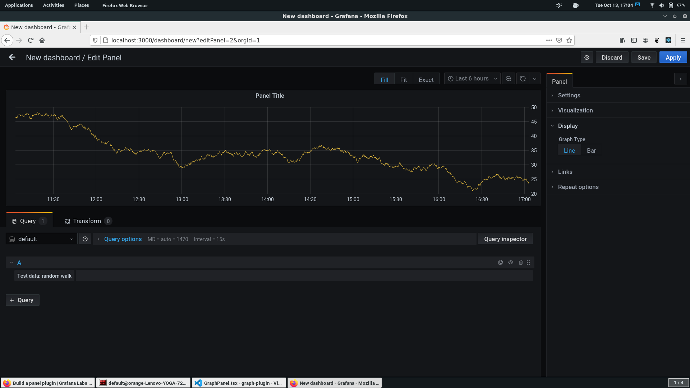
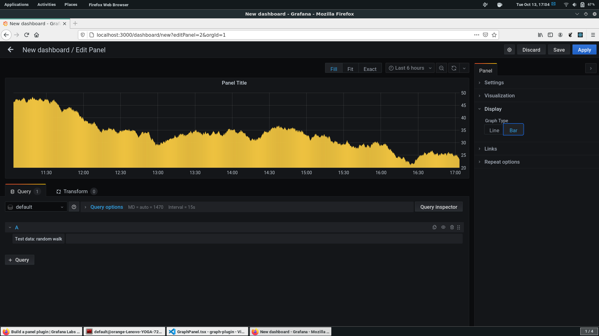

# Grafana Graph Panel Plugin Tutorial

This repository contains full working code to accompany [this](https://medium.com/@hariom.2711/grafana-react-panel-plugins-545cb9afa42d) tutorial. The tutorial presents a step-by-step guide to create custom Graph Panel Plugins for Grafana  
We create a simple Graph Panel which plot a time-series data using `Graph` component of Grafana's UI library. Making custom plugins helps customizing your panels according to your needs. As a simple customization, the code here provides options to user to change between bar graphs and line graphs. 

## Pre-requisites

* TypeScript
* React
* Grafana

## Final Product

Line Graph



Bar Graph



## What is Grafana Panel Plugin?
Panels are the building blocks of Grafana. They allow you to visualize data in different ways. While Grafana has several types of panels already built-in, you can also build your own panel, to add support for other visualizations.

For more information about panels, refer to the documentation on [Panels](https://grafana.com/docs/grafana/latest/features/panels/panels/)

## Getting started
1. Install dependencies
```BASH
npm install
```
2. Build plugin in development mode or run in watch mode
```BASH
npm dev
```
or
```BASH
npm watch
```

Start the Grafana server on your system. Make sure the root directory of the plugin is in the `plugins` directly of Grafana in your system (default is `/path/to/grafana-root/data/plugins`)

## Learn more
- [Beginner Tutorial with options (slightly deprecated)](https://www.youtube.com/watch?v=Y31wnP_jDBY&feature=emb_title)
- [Build a panel plugin tutorial](https://grafana.com/tutorials/build-a-panel-plugin)
- [Grafana documentation](https://grafana.com/docs/)
- [Grafana Tutorials](https://grafana.com/tutorials/) - Grafana Tutorials are step-by-step guides that help you make the most of Grafana
- [Grafana UI Library](https://developers.grafana.com/ui) - UI components to help you build interfaces using Grafana Design System
